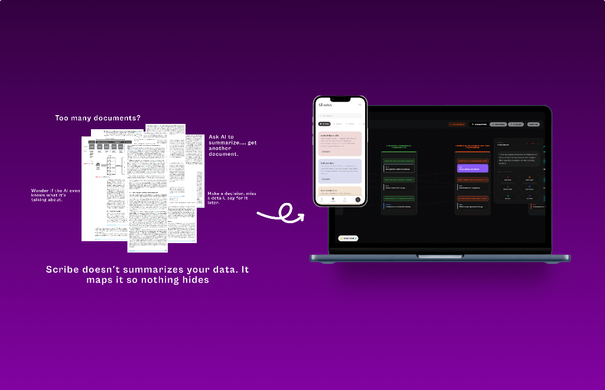
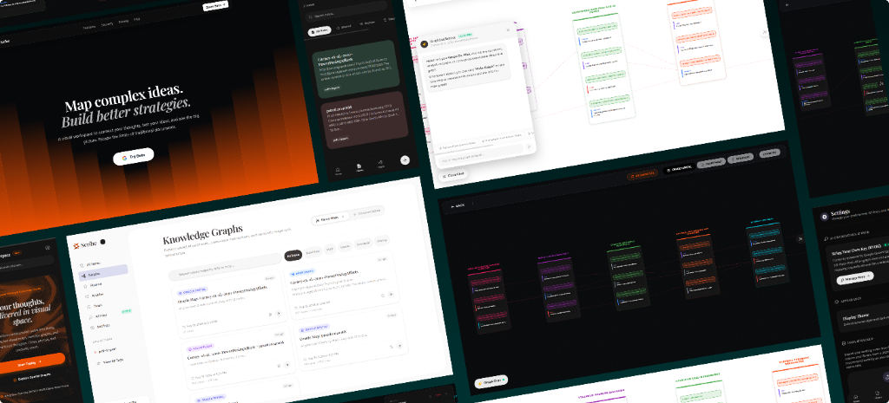
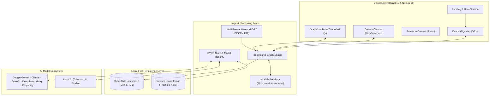

<div align="center">

  

  # **Scribe**
  ### **Map complex ideas. Build better strategies.**

  *A spatial, privacy-first visual workspace to structure your thoughts, stress-test ideas, and see the big picture without the limits of linear documents.*

  <br />

  [](https://nextjs.org/)
  [](https://react.dev/)
  [](https://www.typescriptlang.org/)
  [](https://tailwindcss.com/)
  [](https://dexie.org/)
  [](https://github.com)

  <br />

  

</div>

<br />

---

## 💡 Why Scribe?

In high-stakes work, strategy and research get fragmented across long docs, nested folders, and disconnected spreadsheets. When you ask standard AI chat to help, it often outputs *yet another long text document* or a hallucinatory summary that glosses over critical nuances.

> **"Scribe doesn't summarize your data. It maps it so nothing hides."**

**Scribe** turns linear writing into an interactive **topographic concept map and strategic cockpit**. It reveals hidden dependencies, surfaces strategic risks, and lets you directly dialogue with your documents inside a fluid visual canvas.

---

## ✨ Interface & Feature Showcase

<div align="center">
  
  <p><em>From 10,000-foot multi-pillar roadmaps to granular node-level citations and grounded AI dialogue.</em></p>
</div>

### 🎯 Core Highlights

* 🗺️ **Hierarchical Spatialisation (Oracle & Oatsen Canvases)**
  * Break down complex documents (PDF, DOCX, TXT, Markdown) into clear **Pillars $\rightarrow$ Clusters $\rightarrow$ Leaf Nodes**.
  * D3 and React Flow-powered force graphs, snap-grids, and jerk-free zoom transitions from macro architecture to micro insights.
* 🤖 **In-Canvas Contextual Dialogue**
  * Converse with your entire knowledge graph directly within the canvas.
  * Receive grounded responses with exact source citations. Drag newly generated ideas and conclusions straight onto the canvas.
* ⚔️ **Adversarial Pressure Testing & Risk Tagging**
  * Auto-classify nodes with strategic indicators:
    * 🔴 **`RISK`** — Structural blockers and immediate warnings.
    * 🟠 **`CRITIQUE`** — Foundational disagreements and logical vulnerabilities.
    * 🟢 **`OPPORTUNITY`** — Strategic acceleration and leverage points.
* 🔒 **100% Private & Bring Your Own Key (BYOK)**
  * Your data never leaves your browser. Graph data is persisted locally in client-side **IndexedDB (Dexie)**.
  * Connect your favorite LLM provider using your own API key, or run **100% offline with local models** (Ollama / LM Studio).
* ⚡ **Local Semantic Embeddings & Offline Capabilities**
  * In-browser vector transformations and semantic search powered by `@xenova/transformers` (Wasm / ONNX).
  * Full **Progressive Web App (PWA)** support with touch-optimized mobile navigation.
* 🎨 **Tactical Glassmorphic Design System**
  * Handcrafted Dark Sanctuary and Light modes.
  * Premium typography pairing (`Playfair Display` + `DM Sans`), responsive HUD controls, and smooth micro-interactions.

---

## 🏗️ Architecture & Technical Stack



### 🧰 Technology Breakdown

| Component | Technology | Description |
| :--- | :--- | :--- |
| **Framework** | [Next.js 16 (App Router)](https://nextjs.org/) + [React 19](https://react.dev/) | Modern hybrid rendering and performant client routing |
| **Styling & Motion** | [Tailwind CSS v4](https://tailwindcss.com/) + [Framer Motion](https://www.framer.com/motion/) | Responsive dark/light layouts, glassmorphism, fluid physics |
| **Graph & Spatial Engines** | [D3.js](https://d3js.org/) + [@xyflow/react](https://reactflow.dev/) + [@tldraw/tldraw](https://tldraw.dev/) | High-performance interactive canvases, node clustering, and freeform sketching |
| **Client Storage** | [Dexie.js](https://dexie.org/) & [idb](https://github.com/jakearchibald/idb) | Fast, indexed, offline-first client-side database |
| **Document Ingestion** | `pdfjs-dist` + `mammoth` | Extraction and cleaning from PDFs, Word documents, and text files |
| **Local ML & Inference** | [@xenova/transformers](https://huggingface.co/docs/transformers.js) | In-browser client-side embeddings via WebAssembly |
| **Typography & Icons** | `Playfair Display`, `DM Sans`, `Lucide React`, `Phosphor Icons` | Elegant serif headlines and clinical sans-serif UI tokens |

---

## 🔑 Supported AI Providers (BYOK)

Scribe supports instant switching between major cloud providers and local offline models:

| Provider | Supported Models / Protocol | Setup |
| :--- | :--- | :--- |
| **Google Gemini** | `gemini-2.5-flash`, `gemini-1.5-pro`, `gemini-1.5-flash` | Gemini API Key |
| **Anthropic Claude** | `claude-3-7-sonnet`, `claude-3-5-sonnet`, `claude-3-haiku` | Anthropic API Key |
| **OpenAI GPT** | `gpt-4o`, `gpt-4o-mini`, `o1`, `o3-mini` | OpenAI API Key |
| **DeepSeek** | `deepseek-chat`, `deepseek-reasoner` | DeepSeek API Key |
| **Groq / Mistral / NVIDIA** | `llama-3.3-70b`, `mixtral-8x7b`, `nemotron` | Provider API Key |
| **Ollama (Local AI)** | Any local model (`llama3`, `mistral`, `qwen2.5`, `deepseek-r1`) | `http://localhost:11434` (No key required) |
| **LM Studio (Local AI)** | Any local model via OpenAI-compatible endpoints | `http://localhost:1234/v1` (No key required) |

---

## 🚀 Getting Started

### 1. Prerequisites
- **Node.js**: v18.18.0 or higher (Node 20+ recommended)
- **Package Manager**: `npm`, `pnpm`, `yarn`, or `bun`

### 2. Clone and Install

```bash
# Clone the repository
git clone https://github.com/shresthkushwaha/Scribe.git

# Navigate into the project directory
cd scribe

# Install dependencies
npm install
```

### 3. Run Development Server

```bash
npm run dev
```

Open [http://localhost:3000](http://localhost:3000) in your browser.

### 4. Optional Environment Variables

For local-first operation with BYOK, **no environment variables are required**. Everything can be configured directly from the in-app Settings modal.

If you are setting up optional Supabase synchronization or default server fallbacks, copy `.env.local.example` (or configure `.env.local`):

```env
# Optional Supabase Integration
NEXT_PUBLIC_SUPABASE_URL=your_supabase_project_url
NEXT_PUBLIC_SUPABASE_ANON_KEY=your_supabase_anon_key

# Optional Default Fallbacks
NEXT_PUBLIC_DEFAULT_AI_PROVIDER=google
```

---

## 📁 Repository Structure

```
scribe/
├── app/                        # Next.js App Router
│   ├── graph/                  # Graph workspace & dynamic route [id]
│   ├── landing/                # Standalone landing views
│   ├── notes/                  # Markdown & rich note editors
│   ├── settings/               # API keys, BYOK, & theme configuration
│   ├── globals.css             # Design tokens & tactical theme variables
│   ├── layout.tsx              # Root HTML layout with providers & fonts
│   └── page.tsx                # Dynamic home page & graph studio launcher
├── assets/                     # README & documentation screenshots
├── components/                 # Reusable UI & canvas components
│   ├── landing/                # Landing page sections (Hero, Bento, CTA)
│   ├── flow/                   # Custom node cards & edge renderers
│   ├── ui/                     # Buttons, modals, tooltips, dialogs
│   ├── BYOKModal.tsx           # Multi-provider API key management modal
│   ├── GraphCanvas.tsx         # D3 & ReactFlow spatial graph canvas
│   ├── GraphChatbot.tsx        # In-canvas grounded dialogue HUD
│   ├── OracleGigaMap.tsx       # Strategic multi-pillar topographic canvas
│   └── Sidebar.tsx             # Workspace navigation sidebar
├── lib/                        # Core engines, services, & utilities
│   ├── byokStore.ts            # Zustand BYOK state & model registry
│   ├── graphEngine.ts          # Spatial clustering, physics & layout calculations
│   ├── mapStore.ts             # Graph nodes, edges, & history state
│   ├── pdfUtils.ts             # PDF document parsing & text chunking
│   └── documentUtils.ts        # Word (DOCX) & text extraction
└── public/                     # Static assets, icons, & PWA service workers
```

---

## ⌨️ Canvas Shortcuts & Controls

| Action | Shortcut / Gesture |
| :--- | :--- |
| **Pan Canvas** | `Click + Drag Canvas` or `Spacebar + Drag` |
| **Zoom In / Out** | `Scroll Wheel` or `Pinch Gesture` (0.04x to 4.0x) |
| **Create Node** | `Double Click` on empty canvas |
| **Connect Nodes** | Drag from any node connector handle to another |
| **Toggle Chat HUD** | `Cmd / Ctrl + K` or click floating chat pill |
| **Search Nodes** | `Cmd / Ctrl + F` |
| **Fit View** | `Shift + 1` or Fit to Screen button |
| **Delete Selected** | `Backspace` / `Delete` |

---

## 🗺️ Roadmap & Upcoming Features

- [x] **Local AI (Ollama & LM Studio)** support for air-gapped workflows.
- [x] **Oracle Strategic Synthesis** with auto-tagged risks and opportunities.
- [x] **Document Ingestion** for PDF, DOCX, TXT, and Markdown files.
- [ ] **Collaborative Live Canvases** via WebRTC peer-to-peer sync.
- [ ] **Bi-Directional Graph Sync** with Obsidian & Logseq vaults.
- [ ] **Custom Adversarial Personas** for domain-specific executive audits (Legal, Venture Capital, Security).

---

## 📄 License

This project is licensed under the **MIT License** — feel free to use, modify, and distribute it for personal and commercial projects.

---

<div align="center">
  <sub>Crafted with precision for thinkers, strategists, and builders.</sub>
</div>
