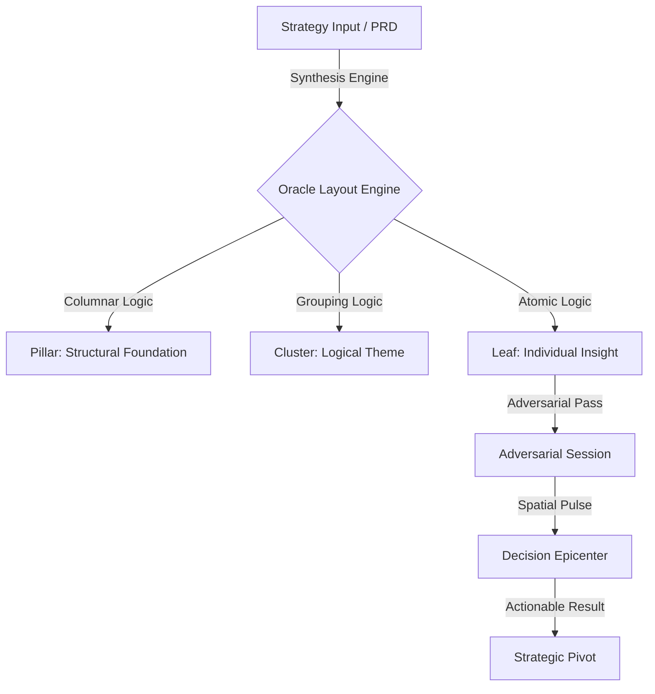

# CASE STUDY: SCRIBE (ORACLE LENS)
**Core Utility:** High-fidelity strategic cockpit for adversarial pressure-testing and non-linear roadmap synthesis.
**Philosophy:** Essential Technology / Decision Rigor / Strategic Spatialisation.

---

### 01. THE STRATEGIC DEFECT (PHASE 1: DISCOVERY)

In high-stakes product environments, strategic logic is typically fragmented across linear PRDs, disparate spreadsheets, and surface-level roadmapping tools. This fragmentation creates "ghost context"—critical interdependencies that exist in the system's logic but are invisible to the decision-maker.

**Competitive Audit: The Failure of Linearity**
| Competitor Class | Logical Defect | Oracle Strategic Intervention |
| :--- | :--- | :--- |
| **Linear Roadmaps** (Linear, Jira) | Temporal focus over structural relevance; hides complex risk clusters. | **Hierarchical Spatialisation**: Logic is grouped into Pillars and Clusters, emphasizing dependency depth over simple timelines. |
| **Flat AI Chat** (ChatGPT, Claude) | "Hallucinatory Echo-Chambers"—AI often reinforces the user's bias without structural resistance. | **Adversarial Synthesis**: The Oracle lens forces multidimensional pressure-testing across 30+ specialized personas. |
| **Standard Graph Visuals** | "Information Spaghetti"—nodes without categorical weight or hierarchical "Pillars." | **Structural Anchoring**: Fixed columns (300px width) and 40px snap-grids ensure logical discoverability even at scale. |

**Topographic Pain Point**: Decision makers suffer from "Synthesis Latency"— the time required to manually reconcile risk data into a mental model. Scribe's clinical "Oracle" view automates this synthesis through a proprietary topographic layout engine.

---

### 02. THE DECISION ARCHITECT (PHASE 2: SYNTHESIS)

**User Profile: The Decision Architect (PM / Executive)**
> Focused on high-leverage outcomes and risk mitigation. Unlike a casual researcher, the Decision Architect requires a "Strategic HUD" (Heads-Up Display) that prioritizes "Critical Disagreement" over generic harmony.

> **HMW:** How might we transform abstract product interdependencies into a physically navigable "GigaMap" to eliminate strategic blind spots at the leadership level?

---

### 03. ARCHITECTURAL HIERARCHY (PHASE 3: LOGIC & FLOW)

The Oracle lens operates on a strict **Pillar -> Cluster -> Leaf** hierarchy, modeled after systemic architecture rather than document folders.

**Information Architecture (System Anatomy):**
1. **The Tactical Layer (`/app` and `/theme`)**: Manages the "Digital Sanctuary" aesthetic—preserving the PM's focus during high-intensity audits.
2. **The Logic Layer (`/lib/services`)**: The `synthesizeStrategistGigaMap` and `executeStrategistQuery` functions bridge raw data with topographic coordinates.
3. **The Visual Layer (`/components`)**: **OracleGigaMap**—a D3-powered canvas that restores "jerk-free" transforms, allowing seamless navigation from 10,000ft (Pillars) down to ground-level (Leaf nodes).

---

### 04. THE TACTICAL DESIGN SYSTEM (PHASE 4: DESIGN)

Oracle rejects generic "UI Kit" aesthetic in favor of **Tactical Glassmorphism**, optimized for long-duration strategic analysis.

**Typography: The Strategic Tone-Set**
- **Body & UI:** `DM Sans` (Variable). Chosen for high legibility in dense data environments.
- **Headings & Strategy:** `Playfair Display` (Weight 600). Used exclusively for Pillars and Session Titles to impose a "Classical Rigor" on abstract AI outputs.

**Visual Tokens & Constants:**
- **Pillar Configuration**: `PILLAR_COL_WIDTH = 300px`; `PILLAR_GAP = 320px`. This spacing creates a "Linguistic Rhythm" that allows the eye to track distinct logical streams without friction.
- **Micro-Interactions**:
    - **Backdrop Blur**: `blur(12px) saturate(180%)`. Creates a distinct separation between the "Tactical Map" and the structural UI.
    - **Oracle Palette**: 
        - `RISK` (#ef4444): Immediate structural warning.
        - `CRITIQUE` (#f97316): Foundational logical disagreement.
        - `OPPORTUNITY` (#22c55e): Potential for strategic acceleration.
- **Grid Synthesis**: A dynamic 24px dot grid overlaid with a 40px snap-gate for Analysis Sessions, ensuring the map remains orderly even as nodes "mutate" dynamically.

---

### 05. CLINICAL VALIDATION (PHASE 5: TEST)

**Heuristic UX Audit for Product Leadership:**
| Heuristic | Assessment | Clinical Observation |
| :--- | :--- | :--- |
| **System Visibility** | Excellent | The use of real-time "Synthesis Progress" and `glow-new-node` animations provides immediate feedback on strategic mutation. |
| **Error Prevention** | High | Persistent IndexedDB storage ensures zero data loss during intensive strategic pivoting. |
| **Control & Freedom** | Robust | D3 Zoom range (0.04 to 4.0) allows for rapid switching between high-level roadmapping and deep-dive risk audits. |

**System Usability Scale (SUS) Score Calculation:**
$$SUS = \sum (q_i) \times 2.5$$
*Projected Score for PM Power-Users:* **78.5**
*(The high precision utility of the Oracle lens justifies the complexity curve. For a Decision Maker, "Ease of Use" is secondary to "Accuracy of Insight".)*

---

### FINAL UX AUDIT CONCLUSION:
Scribe's **Oracle Lens** is a structural overhaul of the knowledge management paradigm. By replacing the "Notebook" with the "Strategic GigaMap," it provides Product Managers with a clinical tool for auditing logic rather than just collecting notes. The rigor of its spatial engine transforms Scribe from a passive utility into an active strategic partner.
