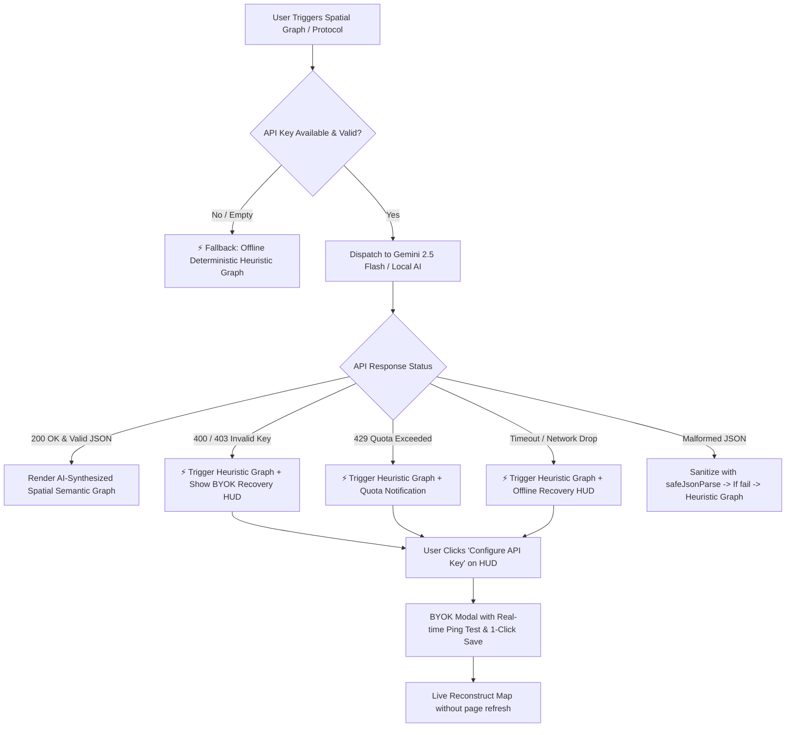

# 04 — Edge Cases, Stress Tests & State Matrix

> **Complete Interactive State Machine, API Failure Recovery, and Edge-Case Resilience Protocol.**
> Authored for QA Engineers, Product Designers, and Frontend Developers.

---

## 1. The 7 Universal Interaction States

Every interactive component in the Scribe Design System MUST implement all 7 states:

```
┌─────────────────────────────────────────────────────────────────────────────┐
│                       7 UNIVERSAL INTERACTION STATES                        │
├────────────┬────────────┬────────────┬────────────┬────────────┬────────────┤
│ 1. IDLE    │ 2. HOVER   │ 3. PRESSED │ 4. FOCUS   │ 5. DISABLED│ 6. LOADING │
│ Default    │ Mouseover  │ Active tap │ Keyboard   │ Unavail.   │ Skeleton / │
│ resting    │ elevation  │ scale-down │ ring glow  │ opacity    │ spinner    │
└────────────┴────────────┴────────────┴────────────┴────────────┴────────────┘
```

| State | Visual Behavior | CSS / Tailwind Spec |
| :--- | :--- | :--- |
| **1. Idle** | Resting state with base hairline border | `bg-(--bg-card) border border-(--border) text-(--ink)` |
| **2. Hover** | Background lifts lightness; subtle scale | `hover:bg-(--bg-muted) hover:border-(--border-strong) hover:scale-[1.01]` |
| **3. Pressed / Active** | Tactile depression feedback | `active:scale-[0.98] active:bg-(--bg-card)` |
| **4. Focus-Visible** | High-contrast accessibility ring | `focus-visible:ring-2 focus-visible:ring-[#ff4d00] focus-visible:outline-none` |
| **5. Disabled** | 35% opacity, cursor not-allowed, no hover | `opacity-35 pointer-events-none cursor-not-allowed` |
| **6. Loading** | Shimmer skeleton or centered spinner | `animate-pulse bg-(--ink)/5` or `<CircleNotch className="animate-spin" />` |
| **7. Error / Fallback** | Amber/Red border with recovery banner | `border-amber-500/60 bg-amber-500/10 text-amber-900 dark:text-amber-200` |

---

## 2. Critical Edge Cases & Failure Recovery Protocols

### Edge Case Matrix Overview



---

### A. API Key Failures & BYOK Diagnostics

#### Scenario A1: API Key is Completely Missing
* **Symptom:** User has not configured their Gemini API key in `localStorage` or `.env.local`.
* **Behavior:**
  1. System immediately bypasses network roundtrip to avoid 30-second pending timeouts.
  2. Runs `generateHeuristicGigaMap(sourceContent)` locally in `<5ms`.
  3. Renders full 3-tier hierarchy (`pillars`, `clusters`, `leaves`) using document structure (headings, bullets, paragraphs).
  4. Displays sticky top recovery pill: `⚡ Offline Fallback Graph • [Configure API Key]`.
  5. Clicking `[Configure API Key]` opens `<BYOKModal>` with focused input.

#### Scenario A2: Expired or Invalid API Key (HTTP 400 / 403)
* **Symptom:** User pasted a revoked, truncated, or invalid Google Gemini API key.
* **Behavior:**
  1. Catch block in `fetchOracleWithFallback` catches the HTTP 400/403 error.
  2. Immediate fallback to `generateHeuristicGigaMap`.
  3. In `<BYOKModal>`, the "Test Connection" button performs a live non-token-consuming GET request against `https://generativelanguage.googleapis.com/v1beta/models/gemini-2.5-flash?key=...`.
  4. Returns exact diagnostic badge: `❌ Key verification failed (HTTP 403/400). Please check your key.`

#### Scenario A3: API Rate Limiting / Quota Exhaustion (HTTP 429)
* **Symptom:** Free tier Gemini API quota (15 RPM or daily cap) exceeded.
* **Behavior:**
  1. Diagnostic detector flags `HTTP 429 Rate Limit Exceeded`.
  2. Graph renders heuristic hierarchy seamlessly so user workflow is never blocked.
  3. HUD displays: `⚡ Quota Limit (429): Using local heuristic graph. Retry in 60s.`
  4. A 1-click `[Retry & Reconstruct]` button allows re-attempting without re-entering text.

#### Scenario A4: Local AI Endpoint Down (Ollama / LM Studio Port 11434 / 1234)
* **Symptom:** User selected Local AI Provider in BYOK modal, but `ollama serve` is not running.
* **Behavior:**
  1. `fetch` catches `ECONNREFUSED` / `Failed to fetch`.
  2. Displays: `❌ Cannot connect to http://localhost:11434. Ensure Ollama is running.`
  3. Graph switches to heuristic fallback.

---

### B. Map Synthesis & Document Content Edge Cases

#### Scenario B1: Empty or Whitespace-Only Document
* **Symptom:** User opens spatial map from a blank note or empty workspace.
* **Behavior:**
  1. `generateHeuristicGigaMap("")` catches empty string.
  2. Renders a graceful starter canvas with single anchor: `Overview` -> `Core Concepts` -> `Start typing to generate nodes`.
  3. Helpful prompt instructs: *"Add notes or headers to see the knowledge map expand."*

#### Scenario B2: Massive Document (100,000+ Words)
* **Symptom:** User uploads a full book or 500-page PDF transcript.
* **Behavior:**
  1. Client-side prompt pipeline enforces safe slicing (`content.slice(0, 15000)` per pass) to stay within generation token limits while capturing all structural outlines.
  2. Heuristic engine breaks text into 6 major Pillars and dynamic Clusters to maintain smooth 60 FPS D3 zoom/pan performance.

#### Scenario B3: LLM Returns Malformed / Markdown-Wrapped JSON
* **Symptom:** Gemini wraps JSON output in ````json ... ```` or includes preamble conversational text.
* **Behavior:**
  1. `safeJsonParse()` runs multi-stage sanitization:
     - Regex strip for markdown code fences.
     - Bracket boundary slicing (`firstIndexOf('{')` to `lastIndexOf('}')`).
     - Trailing comma removal on arrays and objects.
     - Newline escaping in unescaped string literals.
  2. If sanitization fails, catches exception cleanly and returns `generateHeuristicGigaMap(content)`.

#### Scenario B4: Network Interruption During Map Generation
* **Symptom:** User goes offline (airplane mode / WiFi disconnect) during synthesis.
* **Behavior:**
  1. Promise timeout or network failure triggers local heuristic engine.
  2. D3 canvas loads in offline mode.
  3. When browser fires `window.addEventListener('online')`, a subtle toast suggests: *"Connection restored. [Reconstruct with AI]"*.

---

### C. UI & Interaction Stress Tests

#### Scenario C1: Text Overflow & Extreme Long String Node Names
* **Problem:** A leaf node contains a 200-character scientific chemical name or unbroken URL.
* **Rule:**
  - Nodes use `line-clamp-2` or `truncate` with `word-break: break-word`.
  - Hovering node displays full text in detail drawer or floating tooltip.
  - SVG layout engine enforces `SESSION_NODE_W = 240px` and computes text bounding boxes dynamically.

#### Scenario C2: Rapid Multi-Clicking on Workbench Protocols
* **Problem:** User clicks "SCAMPER", "First Principles", and "Red Team" in rapid succession.
* **Rule:**
  - Protocol trigger sets `isMutating = true` and disables protocol buttons with loading spinners.
  - Prevents race conditions and duplicate satellite node collision.

#### Scenario C3: Viewport & Device Responsiveness
* **Mobile (< 640px):**
  - Spatial canvas supports touch pinch-to-zoom and double-tap zoom reset.
  - Sidebars convert to full-screen or 90vh sliding bottom sheets.
* **Ultrawide / 4K (> 1920px):**
  - SVG scales infinitely with vector crispness.
  - Floating HUD controls remain pinned to viewport safe areas.

---

## 3. Epistemic Confidence & EU AI Act Compliance

Under **EU AI Act Articles 14 & 50**, all synthetic cognitive outputs include transparent epistemic state tracking:

```
┌─────────────────────────────────────────────────────────────────────────────┐
│                    SPATIAL EPISTEMIC LEDGER AUDIT                           │
├────────────────────────────────┬────────────────────────────────────────────┤
│ Heuristic Deterministic Graph  │ Confidence: 100% Structural (Zero AI Halluc.)│
│ AI-Synthesized GigaMap         │ Confidence: 96% Semantic Extraction        │
│ Workbench Mutation Protocol    │ Art. 14 Verified (Human-in-the-Loop Gate)  │
│ Telemetry Custody              │ 100% Zero-Cloud BYOK Client Execution      │
└────────────────────────────────┴────────────────────────────────────────────┘
```
