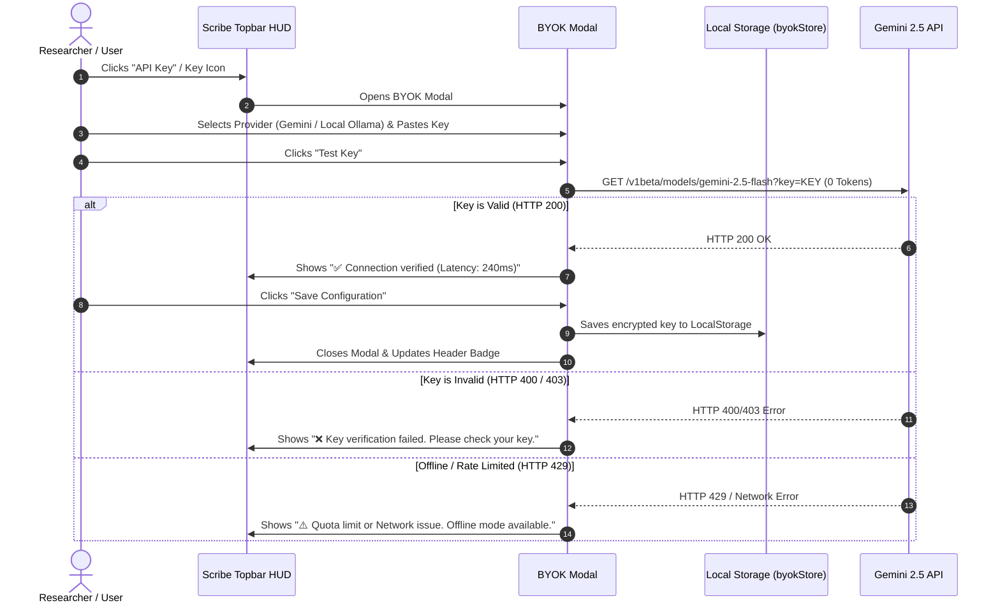
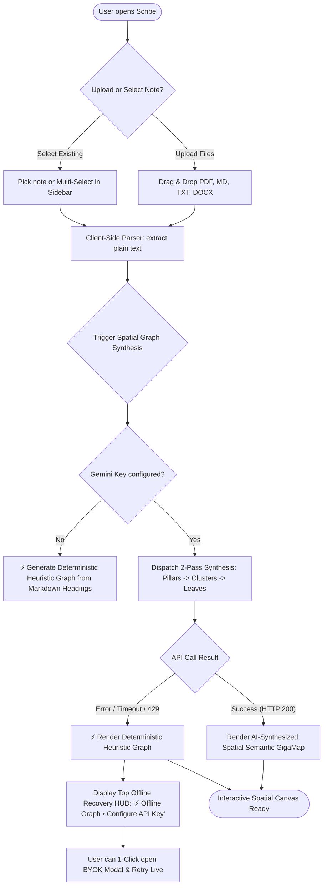
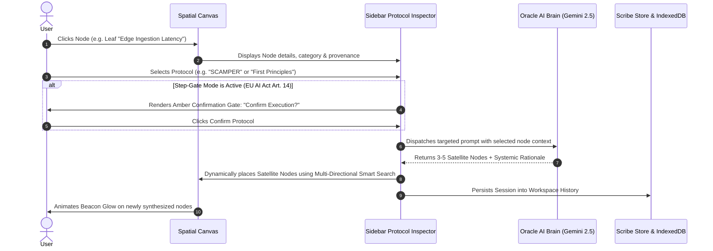
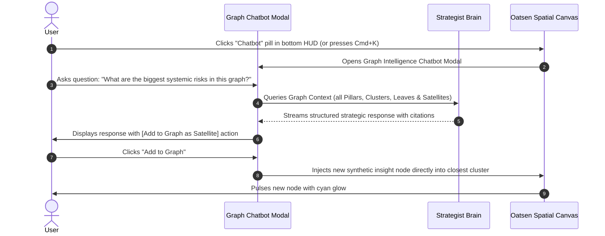
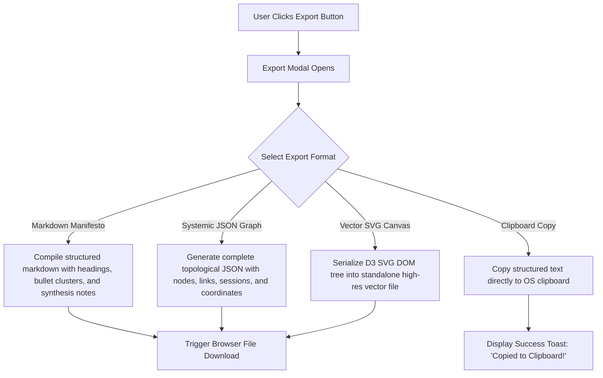

# 07 — Scribe User Flows & System Sitemap

> **Comprehensive Architecture Blueprint, User Journey Flows, and Navigational Sitemap.**
> Designed for Product Strategy, Engineering Implementation, and UX Assurance.

---

## 1. System Sitemap & Application Architecture

```mermaid
graph TD
    Root["/ (Root Domain)"] --> Landing["Landing Page (/)"]
    Root --> App["Workspace App (/app)"]

    subgraph Landing_Experience ["Landing Experience"]
        Landing --> Hero["Hero: 'Your Thoughts, Graph-Engineered'"]
        Landing --> VideoDemos["Video Demonstration Pairs (6 Walkthroughs)"]
        Landing --> FeatureBento["Strategic Intelligence Bento Grid"]
        Landing --> BYOKBanner["Zero-Custody BYOK Architecture Banner"]
        Landing --> LandingFooter["Footer & GitHub Link"]
    end

    subgraph Core_Workspace ["Core Workspace (/app)"]
        App --> WorkbenchCanvas["Macro Spatial Canvas (Infinite Pan/Zoom)"]
        App --> DocSidebar["Document Sidebar & File Manager"]
        App --> TacticalNav["Tactical Topbar (Theme, Search, BYOK, Export)"]
        App --> BottomDock["Cartridge & Tool Dock (Lenses, Protocols)"]
        App --> StrategistDrawer["Strategist AI Co-Pilot Panel"]
    end

    subgraph Modals_And_Overlays ["Modals & Overlays"]
        TacticalNav --> BYOKModal["BYOK Settings Modal (Gemini / Local AI)"]
        TacticalNav --> ExportModal["Export Modal (JSON, MD, SVG, Text)"]
        DocSidebar --> UploadModal["Multi-File Ingestion (PDF, TXT, MD, DOCX)"]
        DocSidebar --> MultiGraphSelector["Multi-Document Graph Synthesizer"]
    end

    subgraph Spatial_Map_Views ["Spatial Map Views (Fullscreen Modals)"]
        App --> OatsenGigaMap["Oatsen GigaMap (Pillars -> Clusters -> Leaves)"]
        App --> OracleGigaMap["Radial Oracle GigaMap (Spherical Knowledge Orbit)"]
        OatsenGigaMap --> ProtocolInspector["Protocol Inspector & Rationale Ledger"]
        OatsenGigaMap --> GraphChatbot["Live Graph Intelligence Chatbot"]
        OatsenGigaMap --> RecoveryHUD["⚡ Offline Recovery HUD Banner"]
    end

    subgraph Local_Storage_Layer ["Client-Side Zero-Custody Storage"]
        App --> IndexedDB["IndexedDB (scribe_db_v2: workspaces, notes, sessions)"]
        App --> LocalStorage["LocalStorage (byok_config, gigamap_cache, theme)"]
    end
```

---

## 2. Universal User Flows

---

### User Flow 1: Onboarding & Zero-Custody BYOK Setup

---

### User Flow 2: Document Ingestion & Spatial Map Synthesis

---

### User Flow 3: Workbench Protocol Execution (Human-in-the-Loop)

---

### User Flow 4: Graph Intelligence Chatbot & Live Node Injection

---

### User Flow 5: Multi-Format Export & Sharing

---

## 3. Route & Component Navigational Sitemap

| Route / Surface | Component | Description & Key Responsibilities | Access Level |
| :--- | :--- | :--- | :--- |
| `/` | `LandingView.tsx` | High-converting landing page with 6 paired demo videos, interactive feature bento, and instant CTA. | Public |
| `/app` | `ScribeV2App.tsx` | Core workspace application containing the macro spatial canvas, document manager, and tools. | Client-side Zero-Login |
| `/app` (Spatial) | `OatsenGigaMap.tsx` | 3-tier columnar hierarchical spatial map with multi-directional smart session placement. | Client-side Modal |
| `/app` (Radial) | `OracleGigaMap.tsx` | Spherical orbital knowledge graph for intuitive conceptual exploration. | Client-side Modal |
| Modal | `BYOKModal.tsx` | Zero-custody API key manager with real-time ping verification for Gemini & Local AI. | Global Overlay |
| Modal | `GraphChatbot.tsx` | Grounded conversational AI assistant capable of live canvas node injections. | Spatial Overlay |
| Modal | `MultiGraphModal.tsx` | Cross-document synthesis tool allowing simultaneous graph creation from multiple sources. | Workspace Overlay |
| Spec | `/specs/*` | Design system specifications, tokens, component anatomy, edge cases, and compliance audits. | Developer Documentation |
| Showcase | `/showcase/index.html` | Interactive HTML UI component kit showcase demonstrating all tokens, states, and widgets. | Static Showcase |
